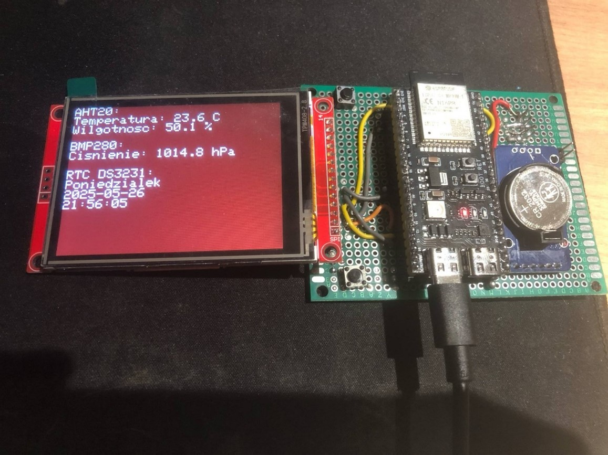
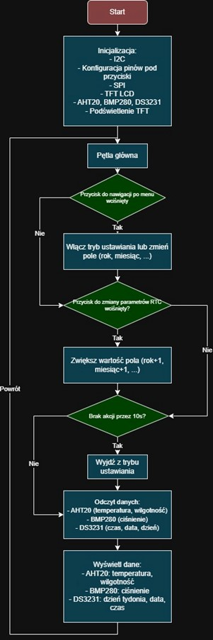
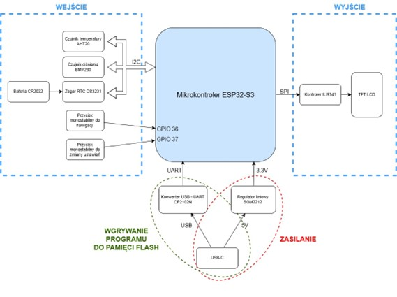

# tft-sensor-esp32

Arduino project for the ESP32-S3 that displays real-time environmental data on a TFT LCD screen. It integrates the following sensors and modules:

- **DS3231 RTC** – provides accurate current time
- **AHT20** – measures temperature and humidity
- **BMP280** – measures atmospheric pressure

The data is visually presented using the Adafruit GFX and ILI9341 libraries for smooth and colorful rendering on the TFT display.

**For Polish users**

Schemat blokowy urządzenia:

Schemat blokowy algorytmu działania:
